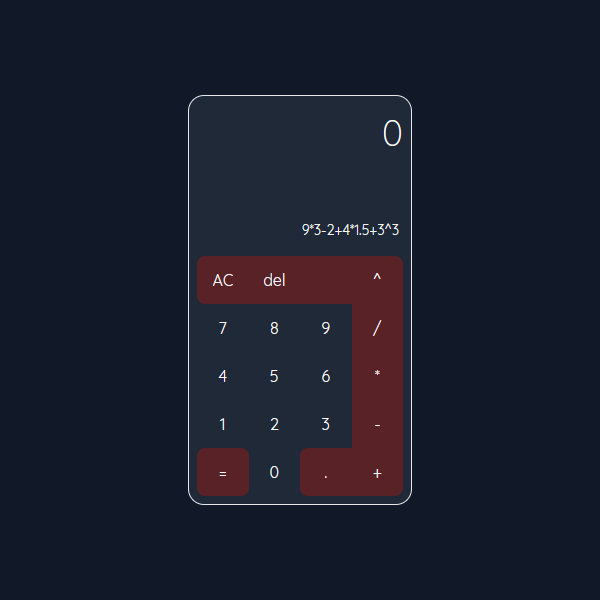

# Calculadora diferentona

Este é um projeto simples de uma calculadora, porém funciona através do cálculo da expressão inserida e leva em consideração a ordem de prioridade entre das operações matemáticas (transforma uma expressão infixa convencional a posfixa para calcular o resultado).



[Clique aqui para acessar a página da aplicação no Github Pages.](https://hennanlewis.github.io/calculadora-diferenciada)

### Mas o que é uma expressão infixa e posfixa?

Na expressão infixa, a posição dos operadores matemáticos fica entre os números, da seguinte forma: `a+b`.
Na expressão posfixa, a disposição dos operadores acontece após os dois números a serem operados, da seguinte forma: `ab+`.

Em casos de expressões com mais de um operador, a resultado do cálculo acontece de forma a calcular as operações que aparecem antes da esquerda pra direita.

### Comparação de cálculo entre os dois tipos

Os próximos exemplos demonstram o funcionamento das expressões da notação infixa e posfixa equivalentes, respectivamente:

`a+b*c-d = a+e-d = f-d = g`

`abc*+d- = ae+d- = fd- = g `

Como podemos observar, no segundo tipo de notação, não existe a necessidade de fazer a checagem de quais números operar primeiro, pois a ordem apresentada indica a operação, o que facilita a interpretação da expressão por um algoritmo para calcular. O algoritmo de conversão é um tanto complicado de entender a princípio, mas depois de entender ele é até bastante simples e genial!

[Clique aqui para ir ao arquivo com o algoritmo de conversão.](src/utils/infixToPostfixFormat.ts)

## Como executar o projeto

1. Após clonar o repositório, o seguinte código instala as dependências necessárias:

```shell
yarn
```

Caso tenha preferência pelo `npm` como gerenciador de pacotes, utilize:

```shell
npm install
```

2. Após a finalização da instalação das dependências necessárias, o seguinte código executa a aplicação:

```shell
yarn start
```

ou caso tenha preferência pelo `npm` como gerenciador de pacotes:

```shell
npm start
```

- Caso a aplicação não abra automaticamente no navegador, abra [http://localhost:3000](http://localhost:3000) no navegador.

3. Para parar a aplicação, pressione `ctrl+c` no teclado.
